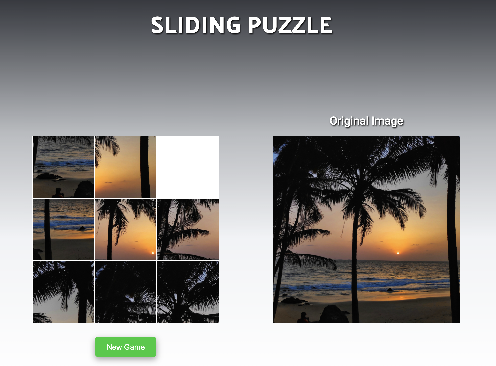

# Sliding-Puzzle

### Instructions:
Rearrange the initial configuration of the tiles to match the original image.

### Technologies:
Javascript, HTML and CSS.

#### Check this App: https://sliding-puzzle-js.netlify.app/

